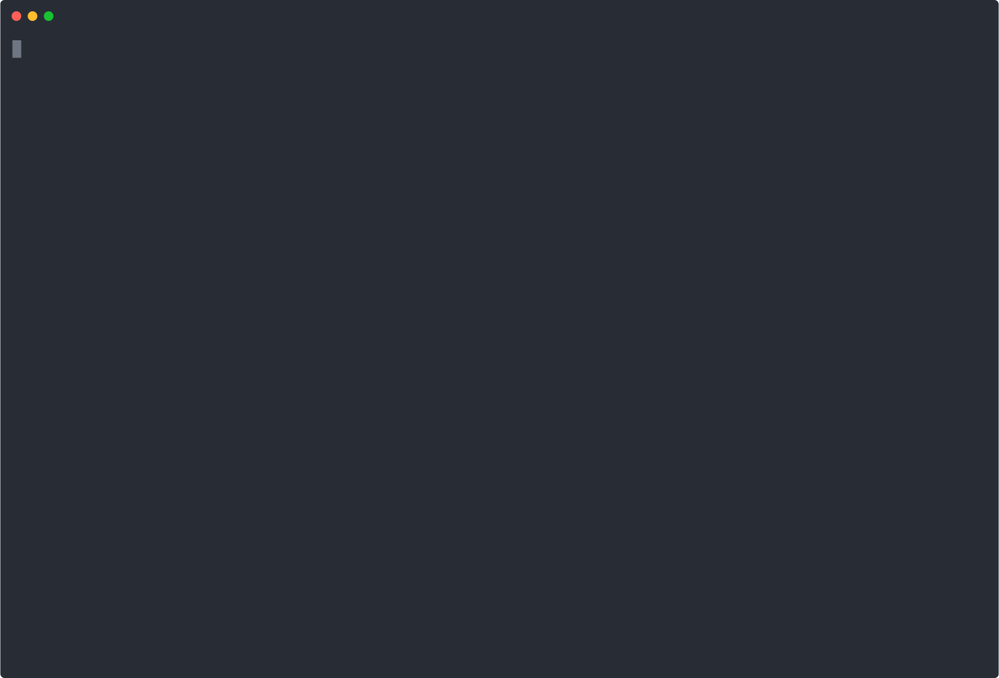

# seekr-hatchery

[](https://pypi.org/project/seekr-hatchery/)
[](https://pypi.org/project/seekr-hatchery/)
[](LICENSE)
[](https://securityscorecards.dev/viewer/?uri=github.com/Seekr-Technologies/seekr-hatchery)
<!-- TODO: switch to dynamic badges once PyPI classifiers propagate and GitHub license detection stabilises:
[](https://pypi.org/project/seekr-hatchery/)
[](LICENSE)
-->

Task orchestration CLI for AI coding agents. Each task gets an isolated git worktree and its own agent session, sandboxed by default inside Docker.

**Sandboxing** *(on by default)* — each task runs in full isolation:
- 🐳 **Docker sandbox**: the agent runs inside a container with carefully scoped filesystem access — read-only repo, write-access only to its own worktree
- 🌿 **Isolated worktree**: each task gets its own `hatchery/<name>` git branch and worktree, so parallel work never conflicts

**Task management** — structured workflow with persistent records:
- 📋 **Plan-first workflow**: plan → approval → implement → commit; enforced by task files the agent must follow
- 🔄 **Resumable sessions**: interrupted sessions pick up exactly where they left off via preserved session state
- 📄 **Task files as records**: each task file becomes a permanent ADR in the repo after completion

<!-- Regenerate SVGs: ./docs/resources/render-svg.sh -->
<table><tr>
<td align="center"><strong>Claude Code</strong><br>
</td>
<td align="center"><strong>OpenAI Codex</strong><br>
</td>
</tr></table>

## Installation

```bash
uv tool install seekr-hatchery
```

To upgrade to the latest release:

```bash
uv tool upgrade seekr-hatchery
```

> **Note:** Do not pin a version on install (e.g. `==0.3.0`) — uv stores the constraint and will refuse to upgrade past it.

Requires Python 3.12+ and at least one agent:
- **Claude Code**: [claude.ai/code](https://claude.ai/code) — `claude` on `$PATH`, `ANTHROPIC_API_KEY`
- **OpenAI Codex**: `npm install -g @openai/codex` — `codex` on `$PATH`, `OPENAI_API_KEY`

## Quick start

```bash
# Start a new task
hatchery new add-auth

# Start a new task using OpenAI Codex
hatchery new add-auth --agent codex

# Resume an interrupted session
hatchery resume add-auth

# Mark complete and remove the worktree
hatchery done add-auth

# See all tasks for this repo
hatchery list
```

## How it works

`hatchery new <name>` creates a git worktree on a `hatchery/<name>` branch, drops a task file there for you to fill in, commits it, then launches an agent session pointed at that worktree. The agent runs inside a Docker sandbox by default — a starter Dockerfile is created automatically on first use. The agent plans, implements, commits, and marks the task complete — all inside the isolated branch. When you're satisfied, `hatchery done <name>` cleans up the worktree and leaves the branch ready to merge.

## Task workflow

When the agent starts a new task it is given a task file at `.hatchery/tasks/YYYY-MM-DD-<name>.md`. The expected workflow:

1. **Plan first** — read the task file, ask clarifying questions, propose a numbered implementation plan. No code until the plan is approved.
2. **On approval** — update the "Agreed Plan" section, then implement step by step.
3. **While executing** — tick checkboxes in the Progress Log after each step, make a descriptive git commit.
4. **If blocked** — stop and discuss before proceeding.
5. **On completion** — mark Status as "complete", add a `## Summary` section. The task file is merged into main as the permanent record.

## Commands

| Command | Description |
|---|---|
| `new <name>` | Create worktree + branch, open task file, launch agent |
| `resume <name>` | Reattach to the existing session exactly where it left off |
| `done <name>` | Remove worktree, retain branch, mark task complete |
| `abort <name>` | Remove worktree without marking complete (branch kept) |
| `delete <name>` | Remove worktree, delete branch, erase all metadata |
| `list` | List all tasks for the current repo |
| `status <name>` | Show task metadata and the full task file |
| `self update` | Upgrade hatchery to the latest release |
| `config edit` | Open `~/.hatchery/config.json` in `$EDITOR` with validation |

All `new` / `resume` commands accept:
- `--no-docker` — skip the container even if a Dockerfile is present
- `--no-worktree` — reuse the current directory instead of creating a new worktree

`new` also accepts:
- `--from <ref>` — fork from a specific branch or commit (default: `HEAD`)
- `--editor / --no-editor` — force editor or prompt mode for the task objective. By default, hatchery prompts in the terminal; set `"open_editor": true` in `~/.hatchery/config.json` to default to `$EDITOR`. If the editor is opened and the file is unchanged on close, the task is cancelled.
- `--agent [claude|codex|opencode]` — choose the AI agent (auto-detected from installed agents)

The chosen agent is stored in task metadata and re-used automatically on `resume`.

## Docker sandbox

By default, `new` and `resume` build a Docker image from `.hatchery/Dockerfile` and run the agent inside it. On first `new`, if no Dockerfile exists, a starter is created for the selected agent and opened for editing:
- `--agent claude` → `Dockerfile.template` with Claude Code
- `--agent codex` → `Dockerfile.codex.template` with OpenAI Codex

Both Claude and Codex support full Docker sandboxing with the API key proxy. `opencode` is native-only (Docker support deferred).

The container receives:

- Full repo mounted read-only (for context)
- `.git/objects` and `.git/logs` read-write (so commits work)
- `.git/refs/heads/hatchery/` read-write (own branch ref)
- The task worktree read-write (the only place edits land)
- `~/.claude` and a per-task `~/.claude.json` (auth) — Claude only
- `~/.codex/AGENTS.md` read-only — Codex only, if present
- `~/.gitconfig` read-only (commit identity)
- `~/.cache/uv` and `~/.ssh` if present

A `.hatchery/docker.yaml` config file is also created alongside the Dockerfile.

### Custom mounts (`docker.yaml`)

`.hatchery/docker.yaml` controls extra host→container bind-mounts injected on every launch. The file is pre-populated with commented examples — uncomment what you need:

```yaml
schema_version: 1
mounts:
  # - "~/.kube:/home/hatchery/.kube:ro"
  # - "~/.aws:/home/hatchery/.aws:ro"
  # - "~/.config/gcloud:/home/hatchery/.config/gcloud:ro"
  # - "~/.oci:/home/hatchery/.oci:ro"
```

Mount format: `"host_path:container_path[:mode]"` — identical to Docker's own `-v` syntax.

- `~` is expanded to your home directory.
- `mode` defaults to `ro` (read-only) if omitted.
- Invalid entries are a hard error. Paths that do not exist on the host are silently skipped.

The file is tracked in git so every developer on the project gets the same mount configuration. Changes take effect on the next `new` or `resume`.

### API key security

The real API key never enters the container. Hatchery starts a lightweight **host-side HTTP reverse proxy** on an ephemeral port immediately before launching the container.

**Claude (Anthropic):**
- `ANTHROPIC_API_KEY` — a random per-task proxy token (useless against the real API)
- `ANTHROPIC_BASE_URL` — pointing to the host proxy (`http://host.docker.internal:<port>`)

**Codex (OpenAI):**
- `OPENAI_API_KEY` — a random per-task proxy token
- `OPENAI_BASE_URL` — pointing to the host proxy (`http://host.docker.internal:<port>`)

The SDK inside the container uses these transparently. The proxy validates the inbound token, strips whatever credentials the container sends, injects the real API key in the correct format (`x-api-key` for Anthropic, `Authorization: Bearer` for OpenAI), and forwards the request over HTTPS. The real key never leaves the host process.

This means a jailbroken or adversarially-prompted agent that reads its API key env var or attempts to exfiltrate it gets only the proxy token — which is worthless outside the session.

The proxy token is stable per-task (persisted across container restarts) so cached credentials stay valid on subsequent `resume` launches.

### Container runtime auto-detection

Hatchery prefers **Podman** as the sandbox runtime when it is installed, falling back to Docker otherwise. Podman is rootless-native: UID 0 inside the sandbox maps to the calling user on the host — not real root. No daemon required. If you have both installed, `podman info` is checked first.

### Podman-in-Podman (DinD)

DinD enables the agent to run a nested container engine inside its Docker sandbox — useful when your tasks involve building container images, running integration tests with Docker Compose, or any workflow that itself needs a container runtime.

**To enable:**

1. Uncomment the `── Podman-in-Podman (DinD)` block in `.hatchery/Dockerfile`. This installs `podman`, `fuse-overlayfs`, and `uidmap`, and wires up a passwordless `sudo` wrapper so the `hatchery` user can invoke Podman.

2. Set `dind: true` in `.hatchery/docker.yaml`:

   ```yaml
   schema_version: 1
   dind: true
   mounts: []
   ```

3. Run `hatchery new <name>` or `resume <name>` — the image rebuild is only slow the first time after the Dockerfile change; subsequent runs hit the layer cache.

**What you can do inside the container:**

```bash
# Run as the `hatchery` user inside the sandbox
podman run --rm hello-world
podman build -t my-image .
podman compose up
```

hatchery automatically provisions `.hatchery/seccomp.json` the first time DinD is enabled. This seccomp profile allows the extra syscalls required by Podman's user-namespace networking stack.

## Session environment

Every agent session launched by `new` or `resume` receives two environment variables:

| Variable | Value |
|---|---|
| `HATCHERY_TASK` | The task name (e.g. `add-auth`) |
| `HATCHERY_REPO` | Absolute path to the repo root |

### Statusline integration

If you use a `~/.claude/statusline-command.sh`, you can show the active task and its branch as a middle line in the status bar. Example — add after building the top line:

```bash
hatchery_line=""
if [ -n "$HATCHERY_TASK" ]; then
    hatchery_branch=$(git -C "$HATCHERY_REPO" --no-optional-locks \
        rev-parse --abbrev-ref HEAD 2>/dev/null)
    cyan=$(printf '\033[0;36m'); yellow=$(printf '\033[0;33m'); reset=$(printf '\033[0m')
    hatchery_line="├ ${cyan}⬡ ${HATCHERY_TASK}${reset}  ${yellow}${hatchery_branch}${reset}"
fi
```

Then output `"$top\n$hatchery_line\n$bottom"` when `$hatchery_line` is non-empty, otherwise `"$top\n$bottom"`. This renders as:

```
┌ user@host  ~/path/to/repo  (hatchery/add-auth ●)  Sonnet
├ ⬡ add-auth  hatchery/add-auth
└ [14:32:01]  [████████░░░░░░░░░░░░] 38%
```

## Storage layout

```
<repo>/
  .hatchery/
    Dockerfile             # optional sandbox definition
    docker.yaml            # optional Docker config (custom mounts, etc.)
    tasks/                 # permanent task records (tracked in git)
    worktrees/             # active worktrees (gitignored)

~/.hatchery/
  meta.json                # DB schema version
  tasks/                   # all per-task state, namespaced by repository
    <repo-id>/             # stable hash of the repo path
      <task-name>/         # one directory per task
        meta.json          # task metadata
        claude.json        # Docker session: auth-stripped ~/.claude.json copy
        proxy_token        # Docker session: stable API proxy UUID
        COMMIT_EDITMSG     # Docker session: git sentinel file
        ORIG_HEAD          # Docker session: git sentinel file
        git_ptr            # Docker session: container-path .git pointer
```

## Development

```bash
uv sync          # install deps and editable package
uv run hatchery --help

uv run ruff format .
uv run ruff check --fix .
uv run pytest tests
```

Version is derived from git tags via `uv-dynamic-versioning`. Without a matching `v*.*.*` tag it resolves to `0.0.0.dev0`.

## Contributing

### PR title format

The PR title must follow [Conventional Commits](https://www.conventionalcommits.org/). The CI validates this on every PR.

```
<type>(<optional scope>)<!>: <description>
```

Allowed types: `feat`, `fix`, `docs`, `chore`, `style`, `refactor`, `perf`, `test`, `build`, `ci`, `revert`, `no-bump`

Individual commits on your branch are **not** validated — use whatever messages work for you while developing.

### Merging

All PRs are merged via **squash commit**. The squash commit message is set to the PR title, which is the only commit that lands on `main`.

### Version bumps

On every push to `main` the CI computes the next version from the squash commit message and creates an annotated git tag. `uv-dynamic-versioning` derives the package version from that tag.

| PR title prefix | Version bump |
|---|---|
| `no-bump:` | none — skips tag and release entirely |
| `feat!:` / any type with `!` | major — `x.0.0` |
| `feat:` | minor — `0.x.0` |
| `fix:`, `perf:` | patch — `0.0.x` |
| everything else | patch — `0.0.x` |

Most merges produce a release. Types like `chore`, `docs`, `refactor` etc. result in a patch bump. Use `no-bump:` to land a commit on `main` without cutting a release (e.g. for CI tweaks or documentation-only changes that do not warrant a version increment).

### Examples

```
feat(cli): add --dry-run flag
fix: handle missing config file gracefully
chore: update ruff to 0.16
refactor(worktree): extract branch-name validation
feat!: rename `new` command to `start`
no-bump: update CI workflow variables
```

### GitHub repository settings (for maintainers)

- **Settings > General > Pull Requests**: enable "Allow squash merging", set default commit message to "Pull request title"
